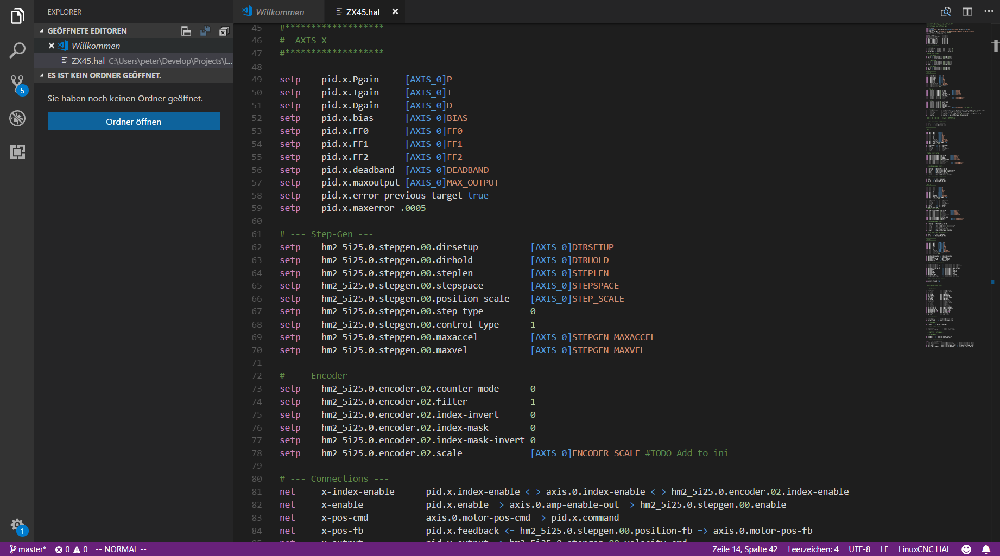

# Visual Studio Code Language support for LinuxCNC

This extension adds basic language support for LinuxCNC files to Visual Studio Code.

## Features

Syntax highlight for LinuxCNC hal files.

## Release Notes

### 0.0.1

Basic support for LinuxCNC HAL syntax
